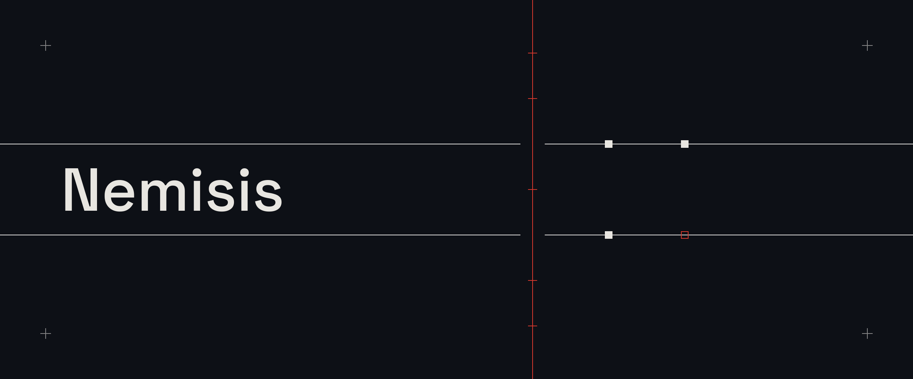
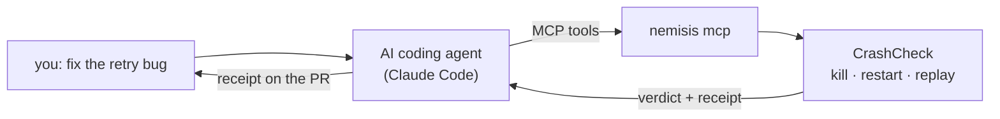

# Nemisis

**Your AI wrote the retry fix. The tests are green. The next crash still charges the customer twice.**

Nemisis is the proof it won't — and the AI runs the proof itself.

[](https://github.com/Alex-lop/Nemisis/actions/workflows/ci.yml)
[](LICENSE)


A test calls your handler once, in one process, with nothing going wrong. Nemisis runs the patch in
a real worker, `SIGKILL`s it the instant a write hits disk, restarts it, replays the same event,
and reads what actually survived. One verdict, one exit code CI can block on.


```text
verdict: PATCH_FAILED_STILL_REPRODUCES
timeline: $25.00 durable -> SIGKILL -> fresh worker -> $50.00
```

| Exit | Verdict | Meaning |
| ---: | --- | --- |
| `0` | `FIX_PROVEN_FOR_THIS_CAPSULE` | Every kill point ended exactly once. |
| `1` | `PATCH_FAILED_…` | The money moved twice, or was lost. |
| `2` | `EVIDENCE_INCOMPLETE` | Something couldn't be observed. Never a guess, never a fallback. |

## The customer is your agent

The person fixing the retry bug is an AI coding agent; the human reads the receipt. Nemisis ships a
Model Context Protocol server and a skill so the agent proves its own fix, with no human in the loop.



A fresh, memory-less agent — given only the server, the skill, a bug report, and one instruction —
did this unaided, in 14 turns:

```text
$ claude -p "Fix the double-credit-on-retry bug and prove it is crash-safe with the nemisis MCP tools."

  → list_scenarios          picks sqlite-credit-v1
  → port_template           gets the store API and a skeleton
  → writes a port           mirrors the real handler against the store
  → map                     sees where a crash loses the credit
  → check                   FIX_PROVEN_FOR_THIS_CAPSULE   (exit 0)
  → edits app/credits.py    applies the same fix, attaches the receipt
```

The receipt and the tool log are committed at
[docs/reports/2026-09-15-agent-demo.md](docs/reports/2026-09-15-agent-demo.md). The kernel that
decides the verdict never calls a model.

## Try it

**Point your agent at it.** From a Nemisis checkout today (from PyPI once `0.2.1` ships the server):

```bash
claude mcp add nemisis -- uv run --project /path/to/Nemisis nemisis mcp
mkdir -p .claude/skills/nemisis && cp /path/to/Nemisis/skills/nemisis/SKILL.md .claude/skills/nemisis/
claude -p "Fix the retry bug and prove it is crash-safe with the nemisis MCP tools."
```

**Or run one check yourself.** Needs Python 3.12+ and [uv](https://docs.astral.sh/uv/) on macOS or Linux:

```bash
uv tool install "git+https://github.com/Alex-lop/Nemisis@main"
nemisis check --base fixture:sqlite-credit-v1/buggy \
  --candidate fixture:sqlite-credit-v1/misleading-green --corrected fixture:sqlite-credit-v1/atomic
```

About two seconds: the green patch fails, the atomic fix passes. Curious how it decides, or want to
try to fool it? → **[How it works](docs/HOW_IT_WORKS.md).**

## What it never does

- **Never touches your repo.** It writes `.nemisis/` and exits — no pushes, merges, or comments.
- **Never lets a model near the verdict.** Models write patches; deterministic code owns the kill
  points and the decision.
- **Never upgrades a label.** `LOCAL` / `FIXTURE` / `MOCKED` / `LIVE` are earned; missing evidence
  fails closed, never a fallback.
- **Never claims what it can't see.** Durable state a handler keeps outside the store has crash
  windows Nemisis can't reach, and it says so instead of guessing.

## Docs

**[How it works](docs/HOW_IT_WORKS.md)** · [Product](docs/PRODUCT.md) · [Security boundary](docs/SECURITY.md) ·
[Proof ledger](docs/PROOF.md) · [Skill](skills/nemisis/SKILL.md) · [Agent guide](AGENTS.md) ·
[Direction](docs/DIRECTION.md) · [Decisions](docs/DECISIONS.md) · [Pitch](docs/PITCH.md)

Apache-2.0. See [LICENSE](LICENSE).
