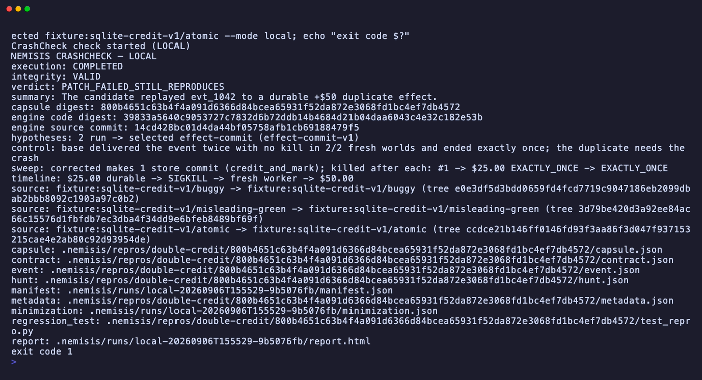
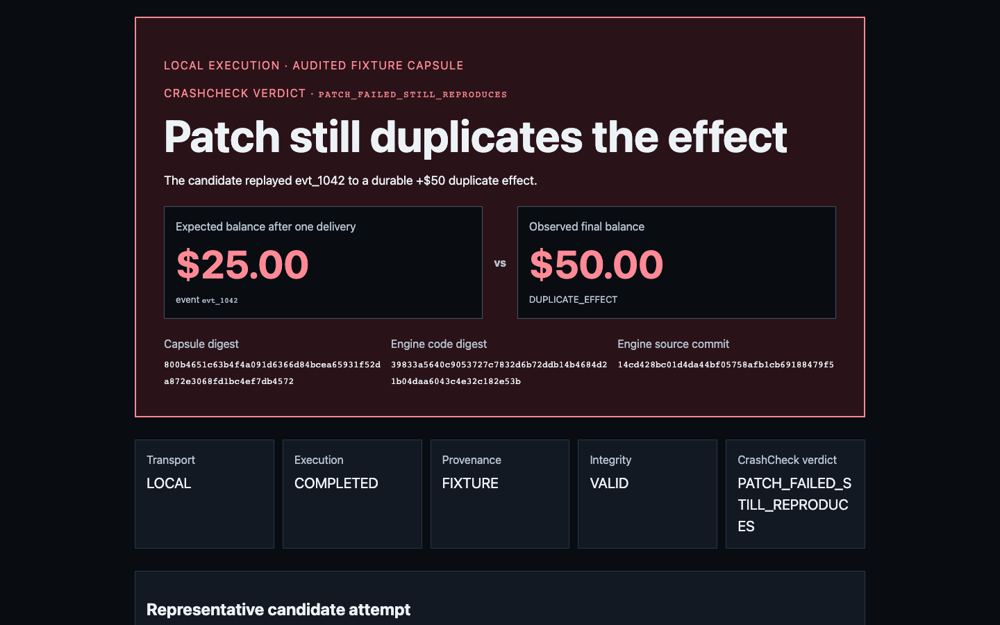
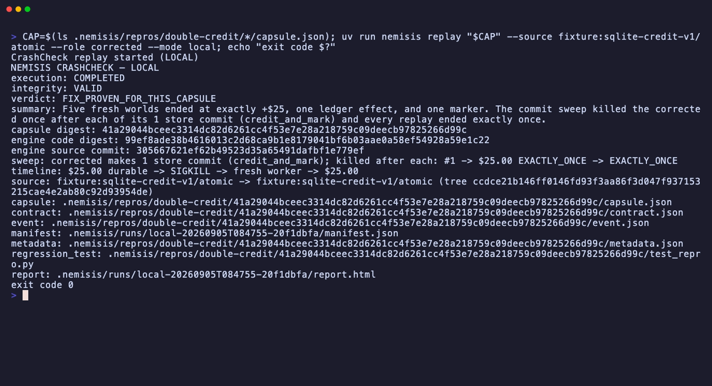
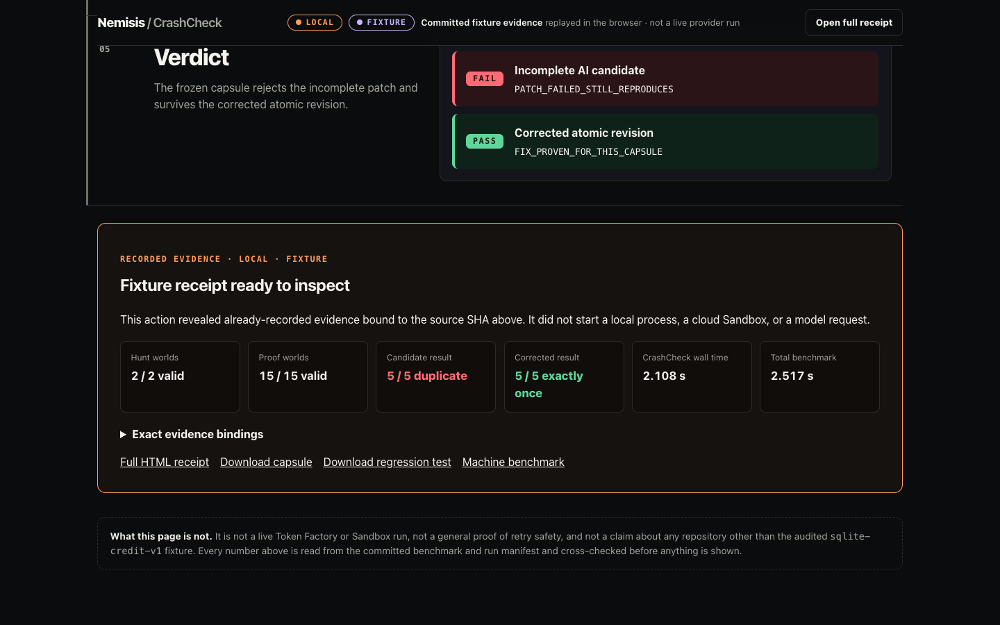
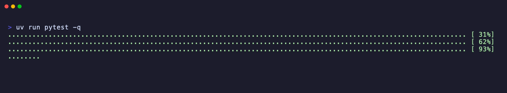
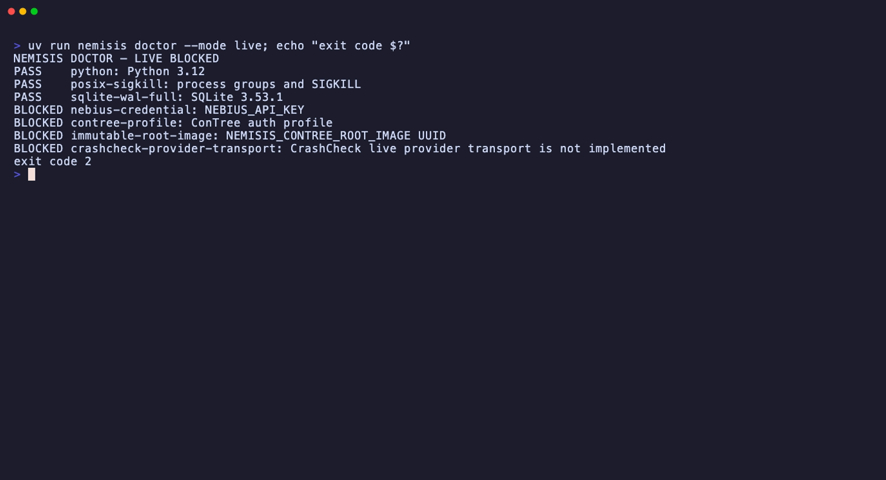

# Nemisis

> Don't ask whether the coding agent says it is done. Make the exact patch prove each claim.

The spelling **Nemisis** is intentional. One breath: AI coding agents ship retry patches that look
green and still double-charge in production; CrashCheck kills the worker after the money moves,
restarts it, replays the same event, and checks the database for a duplicate. See the
[one-page pitch](docs/PITCH.md) and the [90-second demo](docs/DEMO.md).

## See it in action

The recording, the terminal stills, and the reports below are real local runs of the packaged
`sqlite-credit-v1` fixture on this tree. The viewer capture renders the committed hero receipt, which
stays bound to its own earlier commit. Every surface says `LOCAL` and `FIXTURE` because that is what
it is: no provider run is claimed anywhere on this page.


One frozen crash, three revisions: the original bug reproduces, the agent's "fixed" patch still
reproduces, and only the atomic fix survives the same kill and retry. The "fixed" patch
(`misleading-green`) keeps the original's check → credit → mark shape and differs from `buggy` only
in how the code is written: a different tree with the same crash window, and green tests. That is
exactly the kind of diff only an executed crash can judge.



The agent's patch passed its own tests; two seconds after `check` starts, the timeline line shows
`$25.00` durably on disk, a `SIGKILL`, a fresh worker, and `$50.00` in the account.



This is the report a reviewer gets: expected versus observed money, and the digests that bind the
verdict to the exact source tree and the exact engine bytes that ran.



The same frozen capsule replayed against the atomic fix: five fresh worlds (independent database
and worker instances) end at `$25.00`, with one ledger row and one processed marker, exit `0`. The
capsule is the regression test the next patch must beat.



The committed one-minute viewer after stepping through its five recorded steps: the failing
candidate and the passing corrected revision side by side, with the `LOCAL` / `FIXTURE` labels pinned
to the top. It reads a committed receipt from an earlier exact commit and executes nothing.





The whole suite is green, and `doctor --mode live` names exactly what is missing. Three of those
lines are a credential, a profile, and an image you can supply. The last one is the honest boundary:
CrashCheck's own live transport does not exist yet, so CrashCheck verdicts stay `LOCAL` even with
every credential present. A Token Factory key unlocks the Nemotron contract-proposal receipt, and
[docs/LIVE_SETUP.md](docs/LIVE_SETUP.md) is the turnkey path to producing that receipt for real.

### What it does, and what it never does

- **Does:** runs the exact patch in a real worker process, kills it after the durable side effect,
  replays the identical event in a fresh worker, and decides from durable state and process
  receipts. Exit `1` for a patch that still duplicates, `0` for one that does not, `2` when the
  evidence is incomplete.
- **Does:** freezes the crash into a content-addressed capsule and an executable regression test,
  so the next patch is checked against the same kill.
- **Never:** pushes, merges, comments, opens a pull request, or touches your git history. It writes
  a run directory under `.nemisis/` (or `--output-dir`) and prints a decision instead of taking one.
- **Never:** upgrades a label. Local runs are `LOCAL`, the packaged case is `FIXTURE`, injected
  clients are `MOCKED`, and `LIVE` requires a genuine provider receipt. Missing evidence fails closed
  and is never replaced by a fallback.
- **Not yet:** arbitrary repositories, databases, or languages. This alpha audits exactly one
  scenario (`sqlite-credit-v1`) and one two-argument `CreditStore` handler shape, on purpose.

In one sentence: the verdict comes from durable state and process receipts, not from model
confidence.

CrashCheck is the narrow crash/retry product built on Nemisis's broader deterministic differential
verification foundation. Both surfaces remain available; neither claims universal patch safety.

## CrashCheck quickstart

Requires Python 3.12+ and [uv](https://docs.astral.sh/uv/).

```bash
uv sync --frozen --dev
uv run nemisis check \
  --base fixture:sqlite-credit-v1/buggy \
  --candidate fixture:sqlite-credit-v1/misleading-green \
  --corrected fixture:sqlite-credit-v1/atomic \
  --mode local
```

The packaged SQLite case applies event `evt_1042`, which should grant one `$25` credit. The
misleading-green revision is the buggy handler rewritten into the same check → credit → mark shape;
it passes its small existing suite and an ordinary sequential duplicate check, yet still reaches
`$50` after a real `SIGKILL` and retry. The atomic revision ends at `$25`,
one ledger effect, and one processed marker under the same capsule. The measured comparison is
published by `uv run nemisis benchmark`; CrashCheck receipts themselves remain limited to the
kill/restart/replay evidence.

`PATCH_FAILED_STILL_REPRODUCES` and exit `1` are the expected result. Before reading the candidate,
the run executes two fixed base-only hypotheses in parallel and selects the reproducing
`effect-commit` boundary. CrashCheck deletes that sole fault action and runs the empty schedule in
two fresh base worlds; both end exactly once, so deletion is rejected and this one-action schedule
is necessary for the fixture witness. This is not a general minimizer. It then records five fresh
proof worlds per supplied tree, exact source bindings, durable probes, confirmed worker exits, new
worker nonces, and final snapshots.
CrashCheck does not run the fixture's ordinary repository tests; the benchmark measures those
separately as context for the counterexample.

Replay the atomic revision using the `capsule:` path printed by `check` (its directory is the
`capsule digest:` line):

```bash
CAPSULE_PATH=.nemisis/repros/double-credit/PASTE_PRINTED_DIGEST/capsule.json
uv run nemisis replay "$CAPSULE_PATH" \
  --source fixture:sqlite-credit-v1/atomic --role corrected --mode local
```

CrashCheck uses `LOCAL` as the execution transport. The packaged audited contract and capsule carry
the separate `FIXTURE` truth label in the manifest and report. Neither label means `LIVE`.

### Draft the contract with Nemotron

`init --nemotron` asks `nvidia/nemotron-3-super-120b-a12b` on Nebius Token Factory to read the
issue and the exact base handler, select audited catalog IDs, and propose the expected single
effect. It never sees a candidate. Deterministic code accepts the proposal only when it names the
audited fault intent and the exact `amount_cents`; otherwise nothing is drafted and the command
exits `2` with the model's actual values. The sanitized receipt lands in `.nemisis/proposal.json`,
and `check --scenario .nemisis/config.json` carries it into the manifest and report as provenance.
It is labelled `LIVE` only for a genuine Token Factory call, it is never crash evidence, and it never
touches the verdict.

```bash
export NEBIUS_API_KEY=...   # Token Factory key; without it the command fails closed
uv run nemisis init --issue src/nemisis/fixtures/sqlite_credit_v1/issue.md \
  --target app.credits:apply_credit --base fixture:sqlite-credit-v1/buggy \
  --scenario sqlite-credit-v1 --nemotron
uv run nemisis check --base fixture:sqlite-credit-v1/buggy \
  --candidate fixture:sqlite-credit-v1/misleading-green \
  --corrected fixture:sqlite-credit-v1/atomic \
  --scenario .nemisis/config.json --mode local
```

The model call is bounded to structured output over the audited catalog; the prompt template, input,
and response are recorded by digest only. No key, issue text, handler source, or raw response enters
the receipt. [docs/LIVE_SETUP.md](docs/LIVE_SETUP.md) shows the exact success and failure output.

### Open the one-minute evidence viewer

From the repository root, serve the committed static evidence:

```bash
uv run python -m http.server 8000 --bind 127.0.0.1
```

Open <http://127.0.0.1:8000/docs/assets/crashcheck-hero/> and select **Replay fixture evidence**.
The control steps through the five recorded beats and reveals the committed, digest-bound `LOCAL` /
`FIXTURE` receipt; it does not execute repository code, call a model, or start a provider run. If
either JSON binding fails, the viewer shows no behavioral claim. Bind to loopback as shown: the
server exposes the whole checkout, including any `.env`, and browsers block the page's `fetch` on
`file://`, so serve it.

### Use the audited SQLite adapter in a trusted repository

`init` writes strict JSON at `.nemisis/config.json`. A non-packaged contract remains `DRAFT` until
the exact printed digest is accepted. This alpha does not analyze arbitrary handlers, databases, or
languages; it accepts only `sqlite-credit-v1` and the fixed two-argument `CreditStore` contract.

Install the CLI once, then run these from your own repository (`uv run nemisis` only exists inside
this checkout):

```bash
uv tool install "git+https://github.com/Alex-lop/Nemisis@main"   # or a reviewed commit SHA
nemisis init --issue issue.md --target app.credits:apply_credit --base main \
  --scenario sqlite-credit-v1
nemisis init --issue issue.md --target app.credits:apply_credit --base main \
  --scenario sqlite-credit-v1 --accept-contract PASTE_PRINTED_DIGEST
nemisis check --base main --candidate HEAD --scenario .nemisis/config.json --mode local
```

Acceptance re-seals the draft under a new `LOCAL` digest; the CLI prints both. Rerunning `init`
with the same issue, base, and target is a no-op, rerunning `--accept-contract` reports that the
contract is already accepted, and a different issue, base, or target must delete
`.nemisis/config.json` first. `nemisis benchmark` runs only inside this checkout. Passing the
reviewed config explicitly supports this pre-commit first run. Once the config is committed on the
base ref, the scenario ID loads only that exact base-owned copy; cwd and candidate copies cannot
override it. Evaluating a Git ref with a dirty working tree prints a warning: the commit, not the
checkout, is what ran.

Git refs are resolved to full commit SHAs. Fixture refs retain their exact fixture identity; local
directories are identified by their copied tree digest. Each `AnchorBinding` records the supplied
ref, resolved identity, and tree digest. `.git`, `.nemisis`, bytecode, and local pytest/mypy caches
are excluded from source materialization and cannot perturb the bound source tree.

CrashCheck commands support `--json`; progress stays on stderr. Their exit policy is:

| Exit | Meaning |
| ---: | --- |
| `0` | `FIX_PROVEN_FOR_THIS_CAPSULE` |
| `1` | `BUG_REPRODUCED` or `PATCH_FAILED_STILL_REPRODUCES` |
| `2` | `EVIDENCE_INCOMPLETE`, `UNSUPPORTED_TARGET`, invalid input, or infrastructure failure |

Every run writes a manifest beneath `.nemisis/runs/<run-id>/`. Attempt-bearing runs add a report;
the golden path also records the full single-action deletion receipt. A pre-execution mapping
failure instead adds `anchor-resolution.json`. Immutable repro assets live under
`.nemisis/repros/double-credit/<capsule-digest>/`; runs that completed with valid integrity add the
executable integration/fault regression. Stored paths are artifact-root-relative, so the bundle can move without retaining a
host path.

## Differential verifier

The original verifier remains available:

```bash
uv run nemisis verify --fixture idempotency-retry --mode local
```

It runs real subprocesses in separate temporary base and candidate worlds. The same trusted
baseline tests, adversarial tests, runner definition, parser, and bundle bytes run in both worlds.
`verify` is report-only: whenever it produces a matrix it exits `0`, including for a `REJECTED`
artifact decision, so the CrashCheck exit table above does not apply to it. A blocked `--mode live`
run prints no matrix and exits `2`.

| Claim | Relation | Base | Candidate | Verdict |
| --- | --- | --- | --- | --- |
| Reserve available inventory | `INVARIANT` | `PASS` | `PASS` | `SUPPORTED` |
| Reject out-of-stock inventory | `INVARIANT` | `PASS` | `PASS` | `SUPPORTED` |
| Ordinary duplicate retry | `CHANGE_WITNESS` | `ASSERTION_FAIL` | `PASS` | `SUPPORTED` |
| Crash then retry | `CHANGE_WITNESS` | `ASSERTION_FAIL` | `ASSERTION_FAIL` | `UNRESOLVED` |

`LOCAL FIXTURE` means observed local execution of checked-in inputs, not Token Factory evidence.
That `UNRESOLVED` row is where differential testing stops and CrashCheck starts; the
[pitch](docs/PITCH.md#how-it-differs-from-differential-testing-you-have-seen) spells out the
difference.

## GitHub pull requests

Copy [the hardened example](.github/examples/crashcheck.yml) to
`.github/workflows/crashcheck.yml` and commit the accepted base-owned configuration. The example
pins Nemisis to a reviewed full commit SHA and uses `pull_request`, read-only contents permission,
credential-free checkout, a bounded job, a new runner-temporary artifact directory, a job summary,
and uploaded evidence. It refuses untrusted forks because local mode is not a hostile-code sandbox;
those candidates remain blocked until CrashCheck's ConTree transport exists.

## Live boundaries

The original differential verifier has a fixture-only live path:

```bash
uv run nemisis verify --fixture idempotency-retry --mode live
```

It requires `NEBIUS_API_KEY`, a valid ConTree profile, and an immutable UUID in
`NEMISIS_CONTREE_ROOT_IMAGE`. Token Factory defaults to the official global endpoint
`https://api.tokenfactory.nebius.com/v1/` and model
`nvidia/nemotron-3-super-120b-a12b`; an override must still be an official Nebius global or regional
HTTPS `/v1` endpoint. ConTree is constructed from the official client profile.

This live verifier is intentionally limited to the audited `idempotency-retry` fixture and its
validated generated-test subset. Its JUnit report is guest-produced evidence returned through
bounded Sandbox output, not a provider-owned test attestation; arbitrary repositories are not
supported by that trust channel. Networking is disabled during execution.

CrashCheck's own live call is `init --nemotron`; it needs only `NEBIUS_API_KEY`. CrashCheck's
`--mode live` provider transport (running the kill/replay kernel inside a Token Factory Sandbox) is
not yet connected and fails closed. The current environment lacks the Token Factory key, a usable
ConTree profile, and an immutable root image, so there is no current-tree `LIVE` or `RECORDED_LIVE`
receipt for either surface. Nothing falls back to local mode. Run `uv run nemisis doctor --mode live`
for the independent prerequisite checks, and follow [docs/LIVE_SETUP.md](docs/LIVE_SETUP.md) once a
key exists.

## Verify the project

```bash
uv run ruff format --check src tests
uv run ruff check src tests
uv run mypy src tests
uv run pytest
uv build
```

The screenshots and recording above are regenerated by the `vhs` tapes and the capture notes in
[docs/assets/screenshots/](docs/assets/screenshots/); `tests/test_readme_truth.py` fails if any
embedded image is missing, empty, or oddly sized, or if a quoted test count goes stale.

See [product scope](docs/PRODUCT.md), [architecture](docs/ARCHITECTURE.md),
[security boundary](docs/SECURITY.md), [proof ledger](docs/PROOF.md), and the
[benchmark protocol](docs/BENCHMARK.md). The [live runbook](docs/LIVE_RUNBOOK.md) records exact
provider prerequisites and current blockers without substituting local evidence.

Licensed under Apache-2.0; see [LICENSE](LICENSE).
